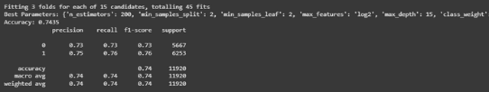
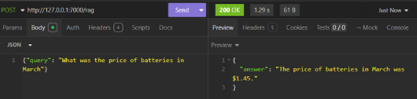
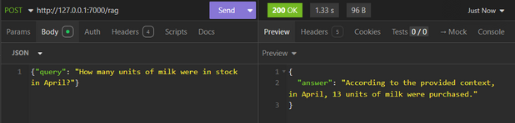
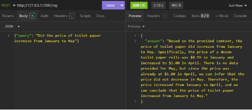
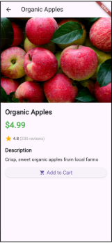
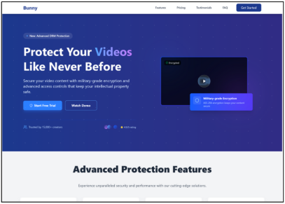
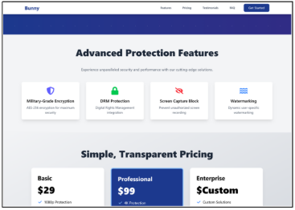
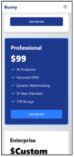
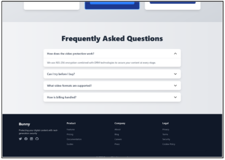

TD Jayadeera **ASSIGNMENT\_01** 03/24/2025

**AI, PYTHON, FLUTTER, AND WEB DEVELOPMENT INTERNSHIP ASSIGNMENT **
## **TABLE OF CONTENTS**
- [Task 1: Python & AI Model Development](#_page1_x0.00_y-7.75) **2**
- [Task 2: AI Sales Agent](#_page3_x0.00_y-7.75) **4**
- [Task 3: Flutter App Development](#_page5_x0.00_y-7.75) **6**
- [Task 4: Web Development](#_page8_x0.00_y-7.75) **9**
- [GitHub](#_page10_x0.00_y-7.75) **11**
## **INTRODUCTION**
Purpose of the Report:

This report outlines the solutions and methodologies developed for the Internship Assignment, designed to evaluate proficiency in AI, Python programming, Flutter app development, and Web Development. Leveraging modern tools and frameworks, the tasks below demonstrate end-to- end implementation of technical concepts, adherence to best practices, and problem-solving capabilities. 
# [**Task 1: Python & AI Model Development](https://github.com/tharusha-dilhara/Assignment_01/tree/main/task1%20\(python-ai\)) **![ref1]**
## **APPROACH SUMMARY**
Employee Attrition Detection
1. ### **Data Collection & Preprocessing**
- **Dataset:** <https://www.kaggle.com/datasets/stealthtechnologies/employee-attrition-dataset>

  

- **Data Cleaning:**
  - **Removed or imputed missing values.**
  - **Converted categorical variables into numeric form using one-hot encoding.**
  - **Scaled numerical features if necessary.**
- **Exploratory Data Analysis (EDA):**
  - **Visualized distributions (e.g., monthly income, distance from home)**
  - **Explored correlations between features and attrition.**
2. **Model Building** 
- **Algorithm:  RandomForestClassifier, LogisticRegression** 
- **Train/Test Split: 80% training, 20% testing** 
- **Hyperparameter Tuning:**

  Explored number of estimators, max depth, and other parameters using RandomizedSearchCV.
3. ### **Model Evaluation**
- **Metrics: Accuracy, Precision, Recall, F1-Score, Confusion Matrix.**
- **Why These Metrics?**
  - Accuracy gives an overall performance measure.
  - Precision, Recall, and F1-Score offer deeper insights into class-by-class performance
# **RESULTS & FINDINGS**
- **Below is a screenshot of the RandomForestClassifier metrics from your training/testing phase:**
  - Accuracy: 0.7347
  - Precision (weighted avg): 0.73
  - Recall (weighted avg): 0.73
  - F1-Score (weighted avg): 0.73

**Demonstration** 

- **Below is a screenshot of the Logistic Regression metrics from your training/testing phase:**
  - Accuracy: 0.7079
  - Recall: 0.7269
  - Precision: 0.7193
  - F1 Score: 0.7231

**Demonstration** 

- **Below is a screenshot of the RandomForestClassifier and Hyperparameter Tuning from your training/testing phase:**
  - Accuracy:  0.7435
  - Precision (weighted avg): 0.74
  - Recall (weighted avg): 0.74
  - F1-Score (weighted avg): 0.74

**Demonstration** 

3**
**CHALLENGES & HOW YOU OVERCOME THEM![ref2]**

- **Imbalanced Classes**

Solution: adjusting class weights in RandomForest.

- **Overfitting**

Solution: Tuned hyperparameters (max\_depth, n\_estimators), used cross- validation, and monitored validation scores.

- **Feature Selection**

Solution: Examined feature importances from the Random Forest model and performed correlation analysis.
## **CONCLUSION**
The RandomForestClassifier achieved ~74% accuracy in predicting employee attrition. It identified key factors (like monthly income and distance from home) that significantly influence turnover.
# [**Task 2: AI Sales Agent](https://github.com/tharusha-dilhara/Assignment_01/tree/main/task2%20\(ai%20sales%20agent\)) **![ref1]**
## **APPROACH**
We built a Retrieval-Augmented Generation (RAG)-based AI Sales Agent using Python. Here’s the workflow:

**Embedding & FAISS Indexing**

- Used SentenceTransformer to convert inventory data into vector embeddings.
- Stored embeddings in a FAISS index for fast similarity search.

**NVIDIA AI Integration**

- Leveraged  the  qwen2.5-7b-instruct  model  via  NVIDIA’s  API  for  answer generation.
- Designed prompts to combine retrieved context with user queries.

**Flask API**

- Created a /rag endpoint to accept user queries via POST requests.
- Returned JSON responses with dynamically generated answers.

5**

# **EXAMPLE SCENARIOS & OUTPUTS**
**Scenario 1: Product Price Inquiry**

**Query:**

{"query": "What was the price of batteries in March?"} **Response:**

**Scenario 2: Stock Availability Check**

**Query:**

{"query": "How many units of milk were in stock in April?"} **Response:**

**Scenario 3: Price Trend Analysis**

**Query:**

{"query": "Did the price of toilet paper increase from January to May?""} **Response:**

- **Irrelevant document retrieval due to sparse data.**

Solution: Fine-tuned the FAISS top\_k parameter to balance relevance and noise.

- **Model sometimes ignored context.**

Solution: Adjusted the prompt template to explicitly prioritize retrieved data

- **API key management.**

Solution: Used python-dotenv to securely load the NVIDIA API key from environment variables.
## **CONCLUSION**
The AI Sales Agent successfully answers product questions using structured inventory data.
# [**Task 3: Flutter App Development](https://github.com/tharusha-dilhara/Assignment_01/tree/main/task3%20\(flutter%20app\)) **![ref1]**
## **APPROACH**
We developed a two-screen Flutter Ecommerce application using the Model- View-Controller (MVC) architecture. Here’s the workflow:

**State Management with Provider**

- Used ChangeNotifierProvider to manage the list of items (ItemProvider).
- The ItemProvider class holds item data and notifies listeners of changes.
- Accessed the provider in HomeScreen via Provider.of<ItemProvider>(context).

**Item Model**

- Created an Item model with properties like id, name, price, imageUrl, etc.
- Structured  data  to  be  reusable  across  screens  (e.g.,  HomeScreen, DetailsScreen)

**Home Screen Implementation**

- Built a scrollable list of items using ListView.builder.
- Designed a custom ItemListTile widget to display item thumbnails, names, prices, and ratings.
- Added a floating action button for a shopping cart (stub implementation).

7**

**Details Screen Design![ref3]**

- Created a DetailsScreen to show full item details, including a large image, description, and "Add to Cart" button.
- Used Navigator.push to navigate from HomeScreen to DetailsScreen on item tap.

**Reusable Widgets**

- Designed ItemListTile as a reusable widget to standardize item displays in lists.
- Included error handling for images with errorBuilder in Image.network.
# **SCREENSHOTS & OUTPUTS**
**Home Screen**

- Displays a scrollable list of items with images, prices, and ratings.
- Tap any item to navigate to its details.

9**

**Details Screen![ref3]**

- Shows enlarged item image, description, and interactive rating/reviews.
- Includes an "Add to Cart" button (non-functional stub).
# **CHALLENGES & HOW YOU OVERCAME THEM**
- **Network images might fail to load.**

Solution:Used errorBuilder in Image.network to display an error icon as a fallback.

- **Ensuring consistent data across screens.**

Solution: Leveraged Provider to centralize item data and avoid redundant API calls.

- **Designing for varying screen sizes.**

Solution: Used SingleChildScrollView and BoxFit.cover for images to ensure responsiveness.
# **CONCLUSION**
This app demonstrates core Flutter concepts: state management with Provider, navigation, and reusable widgets. Future improvements could include a functional cart system, search feature, and dynamic data fetching from an API.

[**Task 4: Web Development ](https://github.com/tharusha-dilhara/Assignment_01/tree/main/task4%20\(web%20dev\)/bunny) **![ref1]**
## **APPROACH**
We built a responsive landing page using React for a fictional product. Here’s the workflow:

**Component Architecture**

- React-based Structure: Created 8 modular components following React best practices
- Responsive Layout: Used Tailwind CSS for mobile-first responsive design

**Key Features**
#### Responsive Navigation Interactive Elements Responsive Design
## **CHALLENGES & HOW YOU OVERCAME THEM**
- **Mobile Menu Transition:**
  - Challenge: Smooth height transition for mobile menu
  - Solution: Used conditional rendering with opacity transitions
- **Scroll-aware Navbar:**
  - Challenge: Performance-friendly scroll listener
  - Solution: useEffect with throttling and cleanup
## **SCREENSHOTS & OUTPUTS**
 

Desktop Mobile

 
# Desktop Mobile
 
# Desktop Mobile
 
# Desktop Mobile
# **GitHub Project Overview**
Repository: [https://github.com/tharusha-dilhara/Assignment_0](https://github.com/tharusha-dilhara/Assignment_01)1 Author: TD Jayadeera

Date: 03/24/2025
13**

[ref1]: Aspose.Words.802dbdfe-0d75-4a49-a176-74edf22bf07d.004.png
[ref2]: Aspose.Words.802dbdfe-0d75-4a49-a176-74edf22bf07d.010.png
[ref3]: Aspose.Words.802dbdfe-0d75-4a49-a176-74edf22bf07d.016.png
